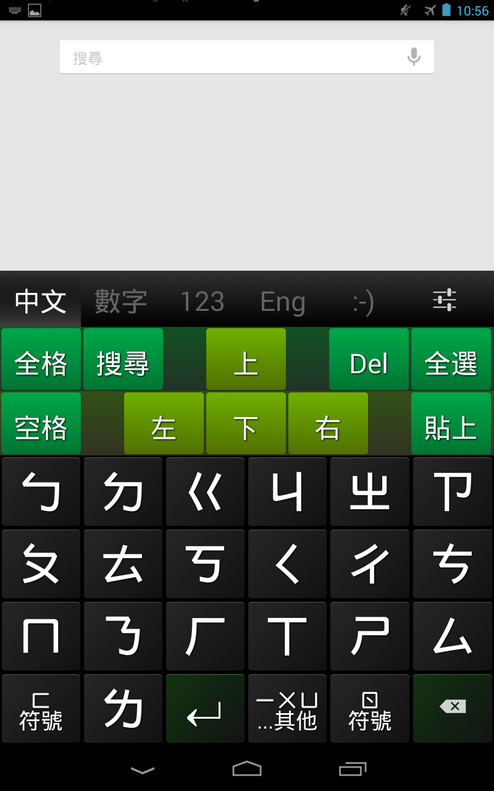
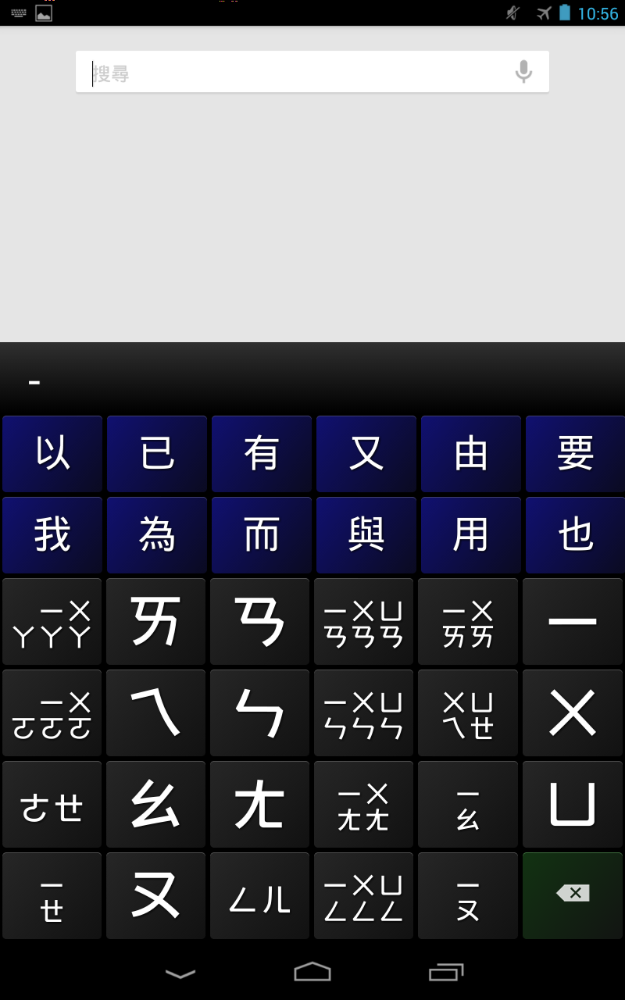
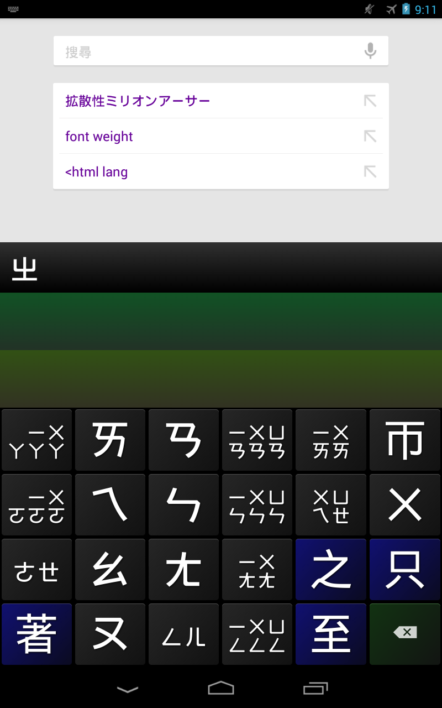
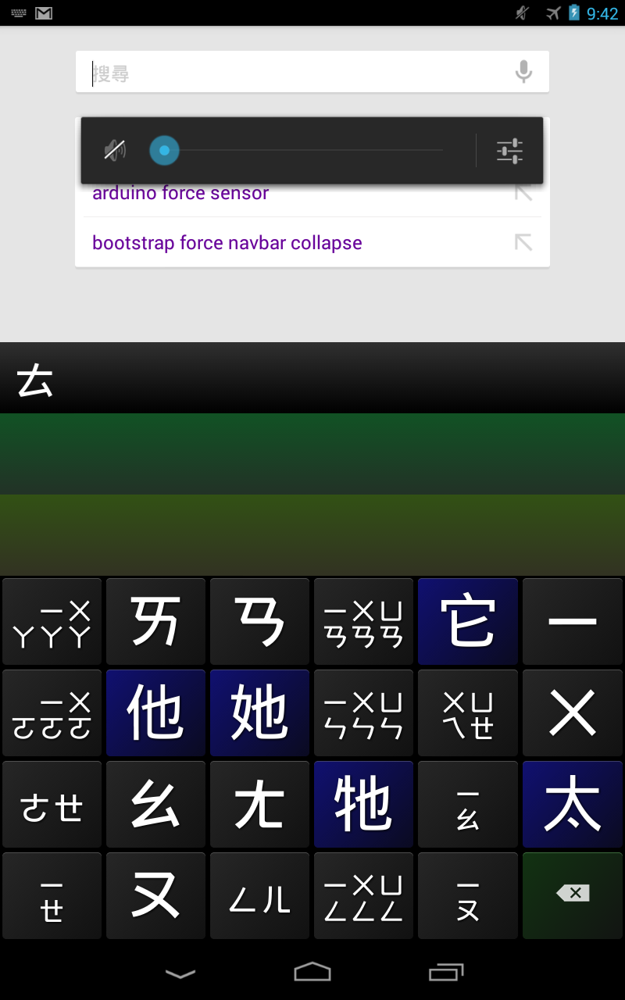
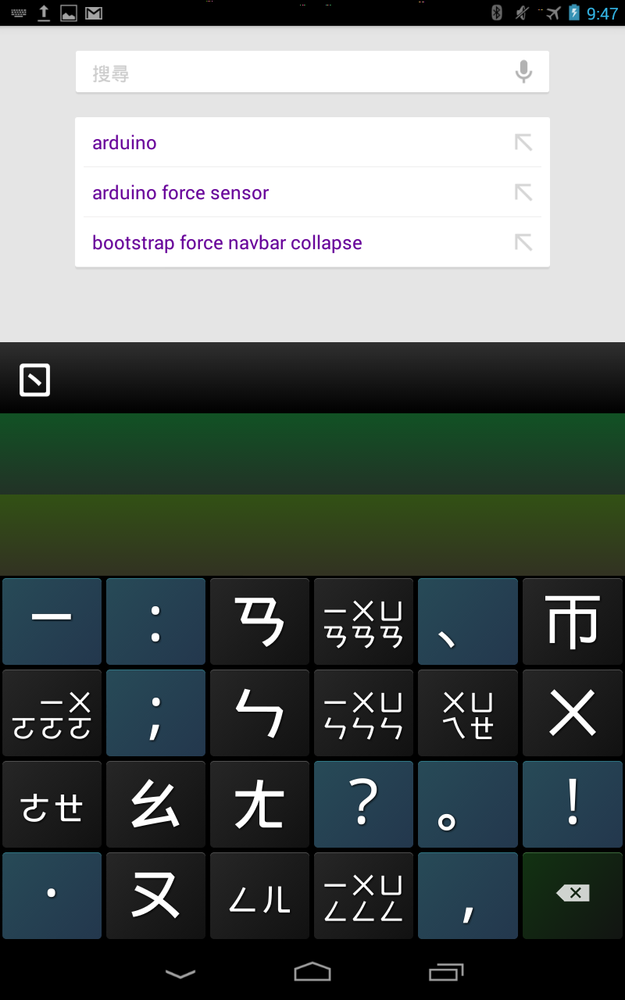

#西瓜輸入法

西瓜輸入法為一個特別為了觸控介面所設計的中文輸入法
更少的按鍵需求，讓使用者有效的提升打字效率

##特殊功能 Feature

* 滑動連續刪除 
* 聲母、韻母鍵盤配置 
* 中文數字鍵盤 
* 顏文字 
* 滑動調整英文大小寫 
* 無縫切換「注音輸入法」與「漢語拼音輸入法」 

##螢幕截圖 

 
 
 
 
 

##問題回報Bug report
如果您發現任何問題的話，請在[這裡](https://docs.google.com/forms/d/1bRFDOxpueoJJG3of2fxUP6uwVuipC3Ibp7A32S1G7Xo/viewform)回報 Bug ，謝謝。

